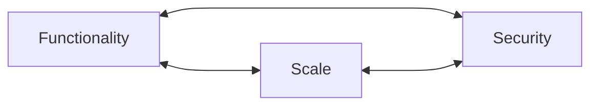

- protection of information systems from theft or damage to hardware, software, or information.
- maintenance of service, avoiding disruption and misdirection.

### Anderson’s Rule

"If you design a large system for ease of access, it becomes insecure, while if you make it watertight it becomes impossible to use"



Systems that handle sensitive personal information involve a trilemma of security, functionality, and scale, of which you can only choose two.

However, we can reduce risk to the system by applying sensible security protocols.

### The CIA Triad
- Confidentiality 
	Ensures information is only accessible by authorised persons. Preventing sensitive information from reaching the wrong people
	
- Integrity
	Ensures that the consistency, trustworthiness and accuracy of data is maintained throughout its lifetime.
	
- Availability
	Guarantee of reliable access to the information by authorised users when needed.


### Threats
Any situation or event, which may be intentional or accidental, that may adversely affect a system.

- Privilege Abuse
- Input Injection
- Malware
- Storage Media Exposure
- Misconfigured Databases
- Unmanaged Sensitive Data
- Denial of Service

### Privilege Abuse
- **Authentication** - Confirm that I am who I am claiming to be
	- logins, MFA, etc.
- **Authorisation** -  •Confirmed who you are, you can access
	- (done via privileges in a DB).
- You need both!

**Excessive privilege**
e.g. an employee who only needs to look at (read) the accounts table but is given write permissions.

**Move/Copy Data**
Downloading data onto (less secure) local machines
E.g., a user downloads all client accounts to perform spreadsheet analysis

**Solution**
- Minimise risk by granting minimal privileges to users
- These may change over time – reduce access, as well as increase it, as appropriate.
- No Superuser bullshit

**Postgresql**
```postgresql
CREATE ROLE username LOGIN;
GRANT UPDATE ON Account to username;
```


### SQL Injection
- Parameterise your query
- Escape all input
- Input Validation
- Use stored procedures – parameterises your code for you

Prevent user input going to DB engine.

**PHP (eww)**
```php
$aName = $_GET["accountName"];
$stmt = $db->prepare('SELECT * FROM Account WHERE name = ?');
$stmt->bind_param('s', $aName);
$stmt->execute();
```


### Password Hashing
- prevent access
- hashing and salt
- use strong hash

### Database Administration
- regular software updates
- audit trails - track user activity
- Physically secure server
- Configure properly