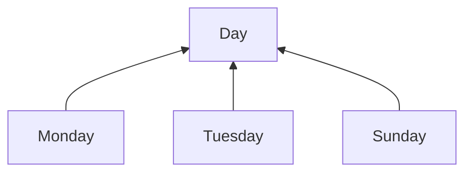
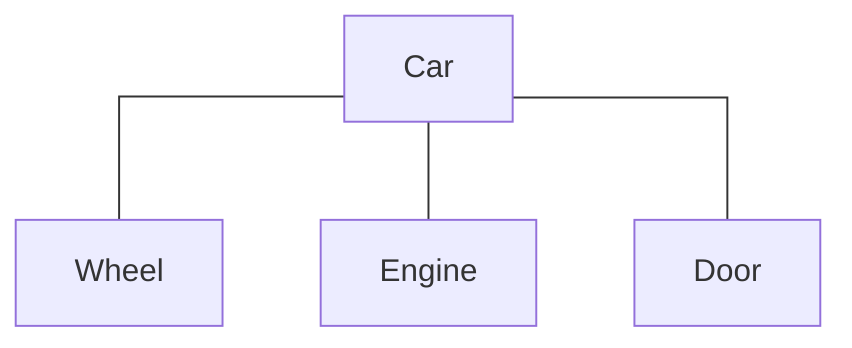
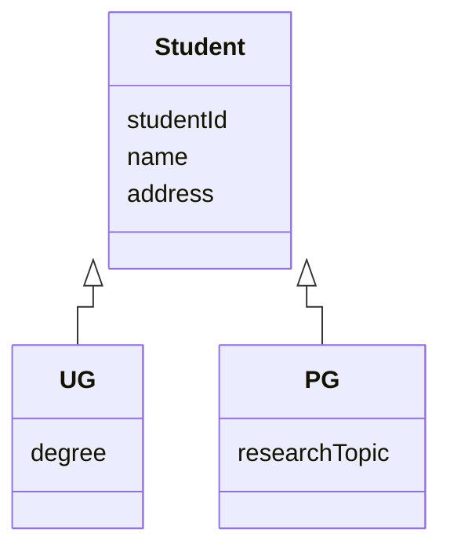
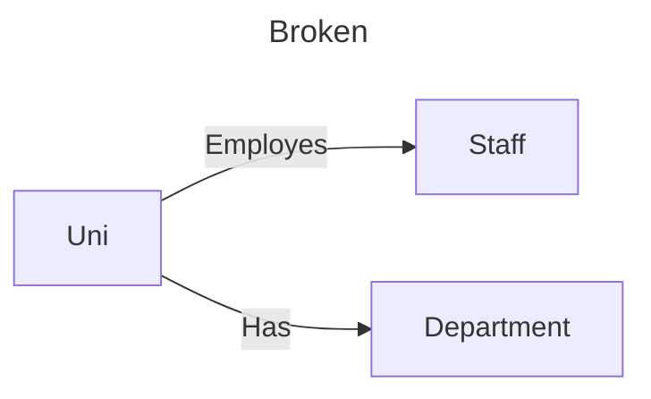
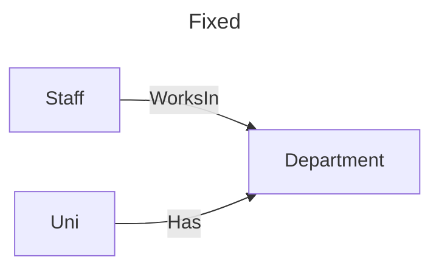
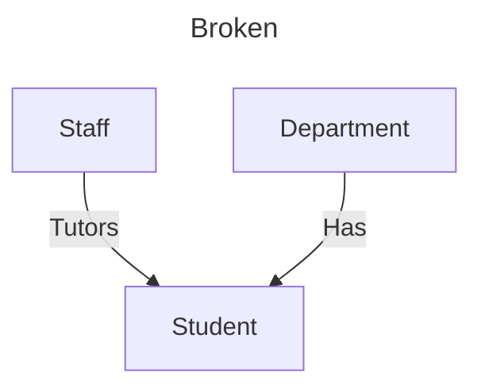
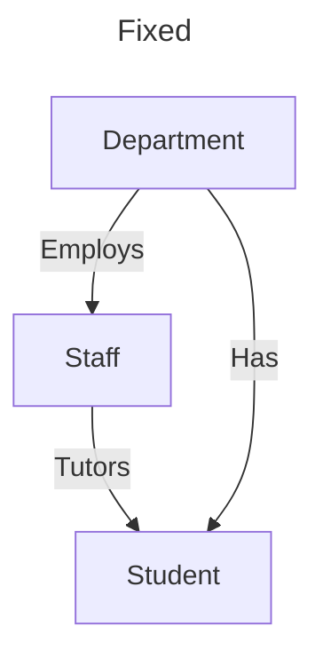

#### Entity-Relationship (ER) Modelling

A top-down approach that begins by identifying the important data: 
1. entities and relationships.
2. More details about these entities and relationships that we want to store are then added, i.e., attributes and constraints.


Three, important, basic concepts:
- Entity
- Attribute
- Relationship
  
# Conceptual data Model

##### Attribute Types
- Single-valued
	- Attribute contains a single value for each instance of an entity
	- E.g. date_of_birth
- Multi-valued
	- Attribute may contain more than one value for an entity
	- E.g., hobby, telephone number
	- Multi-valued attributes are okay at the conceptual level, but not in a relational model.
- Derived
	- Attribute may be derived from other attribute(s)
	- e.g. age is derived from date of birth.


##### Relationships
- Entities can participate to varying degrees in relationships with other entities
- Multiplicity defines the number, or range (i.e., min..max), of possible occurrences

e.g.
```
      1.2                          0..*
Staff ----------- Teaches -----------> Module

Staff can teach [0 or more] Module
Module can be taught by [1-2] Staff
```


### Data Abstraction
high-level approach to data modelling

##### Classification
Process to group or classify objects with common properties to a class or entity.

When we have identified multiple examples of entity occurrences and want to group them

e.g. `Monday`, `Tuesday`, `Sunday` are instances of `Day`



##### Aggregation.
- Aggregation abstraction defines a new class (entity) from a set of other classes
- Represents a is-part-of or has-a relationship between entity types
- One entity represents a larger entity (the “whole”) consisting of smaller entities (the “parts”)




##### Specialisation/Generalisation
- Defines a hierarchical class (superclass) for a collection of classes (subclasses) with common attributes.
- Attributes of the superclass are inherited by subclasses



> Hierarchical relationships cannot be directly implemented in a relational database.
> 
> In data modelling, they can be modelled using Enhanced Entity-Relationship (EER) modelling, i.e., an ER model with additional semantic concepts


###### Participation Constraint

**Mandatory:** `Total`
Each instance of the superclass must also be a member of a subclass (i.e., Total Participation).

> If I am a student, I am either a PG OR UG student (must belong to a subclass)

**Optional:** `Partial`
Each instance of a superclass need not (may not) be a member of a subclass (i.e., Partial Participation)

> I may be an IT specialist but not a specialist in any of Databases, Java, PHP, or UNIX (do not belong to a subclass).

**Disjoint**: `OR`
An instance of the superclass can be a member of only one subclass; not both.

>If I am a student, I am either a PG OR UG student (I cannot be both at the same time).

**Overlapping** `AND`
An instance of the superclass can be a member of more than one subclass.

> Can be an IT specialist and can also be a Database AND Java AND PHP specialist (belong to multiple subclasses).

### Properties of Entity Relationships

##### Degree of a Relationship
number of participating entities in the relationship.

- Unary (or recursive)
- Binary
- N-ary

##### Multiplicity of a Relationship

Participation - minimum number of possible instances
Cardinality - maximum number of possible instances of an entity participating in a relationship.

Written in form `P..C` 

> e.g. `0..**

See [This](#Relationships)

##### Attributes on Relationships
- Attributes can also be assigned to relationships.

> e.g. 
> `Person` - `Owns` - `Car` 
> `Owns` by have attribute - `date_of_ownership`


#### Implications for Entities
Strong Entity - does not depend on the existence of another entity; e.g. (`0..*`)
Weak Entity - depends partially or wholly on the existence of another entity; e.g. (`1..1`)


### The Process
1. Identify the major entities
	e.g. Student, Staff, Module
	
2. Any specialisation/generation, composition
	e.g. UG, PG
	
3. Establish relationships between the entities
	e.g. Staff *Teaches* Module
	
4. Identify attributes associated with each entity
	e.g. Student has `studentId`, `name`, etc…
	
5. Associate attributes with entities or relationships
	e.g. Student is `1.1` with whatever
	
6. Determine the candidate key(s) and choose primary key attribute(s) for each entity type
	e.g. Student has `studentId` as `{PK}`
	
7. Determine the underlying domain for each attribute
	e.g. Name is String, Date Of Birth is Date

### Problems with ER Models

##### Fan trap
occurs between related entities which are indirectly connected by a central entity through two one-to-many relationships that fan out from the central entity.

Restructure ER model to remove the fan trap





##### Chasm Trap
occurs between related entities that are indirectly connected through a pathway that includes partial participation entities.

The pathway between certain related entity instances may not exist.







## Logical Data Model
1. Construct a conceptual data model
2. Resolve many-to-many relationships
3. Resolve hierarchical relationships
4. Map the conceptual data model to a relational schema
5. Add the required constraints


##### 2. Many-to-many relationships

> In a relational model, attribute values are atomic values.
> That is, one value for each attribute in a relation.
> 	More on this when we look at normalisation.
> 	
> For many-to-many relationships, we would need multivalued attributes.
> This is only possible in a conceptual data model.

In a relational model, a many-to-many relationship is resolved (modelled) by:
- Introducing an association entity
- Replace with two one-to-many relationships.

For the new association entity:
- Add any attributes that were part of (on) the many-to-many relationship.
- Add the two primary keys from the two entities from the many-to-many relationship.
	- These become foreign keys (FK) in the association entity.
-  Determine a Primary Key (PK) for association entity
	- Composite Key from the two foreign keys + any other attribute to make it unique if required
	- Add a new attribute to be PK, e.g., an autoincrement ID key


##### 3. Resolve Hierarchical Relationships.
Hierarchical relationships between a superclass and its subclass cannot be implemented directly in a relational database.

###### `for {Total, OR}`

**{Total, OR} - Option 1**
Replace the hierarchy with three tables at the same level, that is:
	One table for superclass and a table for each subclass

- Table for superclass contains shared attributes.
- Add the PK from the superclass (studentID) to both subclass tables, UG and PG
- Specify the two one-to-one (1:1) relationships.

**{Total, OR} - Option 2**
Flatten the relationship by using just one table

- Contains all the attributes of both subclasses, and the shared attributes from the superclass.
- Add an attribute, a flag to distinguish the entity type for the instance. 

**{Total, OR} - Option 3**
Use two tables, one for each subclass

- Each table contains the attributes from the superclass as well as the specialised attributes

> recommended strategy


##### 4. Mapping to Relational Schema
1. Create a relation (table)
2. Add attributes (columns or fields)
3. Underline the primary keys, and italicise the foreign keys {FK} if already known.

**Format**
```
TABLE(attrs, _pk_, *fk*)

e.g.
Staff(_StaffId_, Name, DOB)
```

##### 5. Map Using Appropriate Rules.

###### `one-to-one` Relationships:
- Add an attribute to the **Weak** Entity, that is the foreign of the **Strong** Entity
- If both are strong, or both are weak, your choice :)

> Staff and Department (Heads)
> 
> Department gets `department_head` field


###### `One-to-Many` Relationships
Place the primary key of the **parent** entity (the `one`), as the foreign key of the **child** (the `many`)

> Staff and Student (Tutors)
> 
> Student gets `tutor` field


##### 6. Add the Required Constraints
- Required Data
	  
- Multiplicity 
	Constraints on relationships
	
- Integrity
	- Entity integrity (primary key)
	- Referential integrity (foreign key)
	  
- Alternate Keys
	  For example, module title must be unique
	  
- Attribute Domain Constraints
	The Data Types
	
	**EG**
		ModuleCode is a string of format “COMPxxxx”, where the first four characters are letters, and x refers to a digit.
		Gender can be either ‘Male’, ‘Female’, ‘Non Binary’, Other’, or ‘Prefer not to say’
		CourseworkMark and ExamMark are numbers between 0 and 100 (inclusive).


