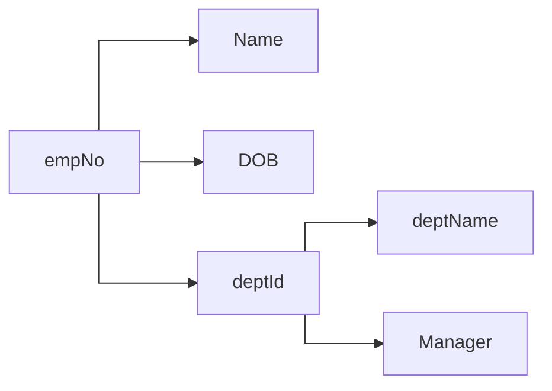
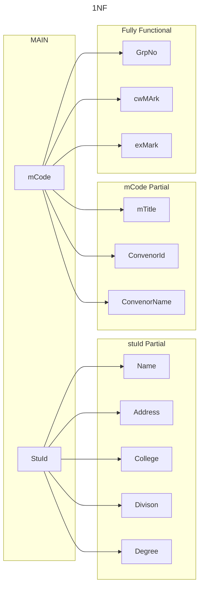
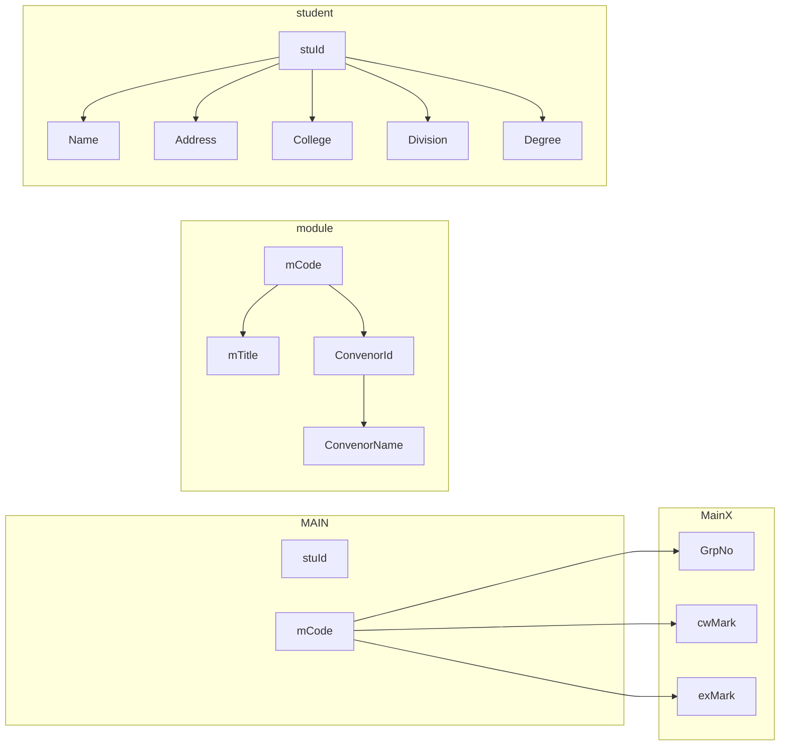

Remove data redundancy (duplication)

**Insertion Anomaly**
- Adding data causes redundant fields to be re-input
	If a new employee is added to a department, the department manager has to be re-input too.
	
- An entity, dependant of redundant fields, may only exist if an instance of its child exists
	A new department can only be added when there exists at least one employee for the new department.

**Deletion Anomaly**
 An entity, dependant of redundant fields, will be removed if an instance of its child is removed.
	 If the last employee from a department is deleted, then all details of that department will disappear from the database.

**Modification Anomaly**
An entity, dependent on redundant fields, will require all instances of its child to be updated
	If the Sales manager, Jones, is replaced by Johnson, all the records for the employees in the Sales department must be updated.

> We can fix this mother-fucking shit by "normalising"

### Functional Dependency (FD)
In a relation (table), some attributes may logically depend on other attributes.
	E.g., Employee’s name, DOB, etc. depend on the primary key, EmpNo
	Manager depends on DeptName

**Functional Dependency: 
- describes the relationship between attributes in a relation (table).
- A property of the meaning (or semantics) of the attributes in a relation.

If `A` and `B` are attributes in a relation `R`, then `A -> B` indicates that:
`B` is functionally dependent on `A`

##### Partial Dependencies
An Attribute that depends on <u>part</u> of the primary key.

##### Full Dependency
An Attribute that depends on <u>all parts</u> of the primary key.

###### Transitive Dependencies
Attribute is dependent on another non-key attribute(s).

- Partial and transitive dependencies are undesirable!
- They result in data redundancy and update anomalies.

### Normalisation Process
- built on concept of normal forms
	- 1NF, 2NF, 3NF, …
	- Successively “stronger”
- But, no information must be lost in the process

####  Unnormalised Form (UNF)
- An unnormalized table contains repeating groups (cells with one or more values
- Not compatible with relational model!

#### First Normal Form (1NF)
- A relation is in 1NF if every attribute for a row contains atomic (single) values only

#### Second Normal Form (2NF)
- A relation is in 1NF
- Every non-key attribute is fully functionally dependent on the primary key – no partial dependencies.

#### Third Normal Form (3NF)
- A relation is in 2NF, and
- Every non-key attribute is not transitively dependent on the primary key – no transitive dependencies.

#### `1NF --> 3NF`
1. Isolate Partial dependencies and Full dependencies
2. Move the partial dependencies into a new relation with the determinant as the primary key.
3. Move the transitive dependencies into a new relation with the determinant as the primary key

#### Example

[[5. SQL]]