1. To transform a query written in a high-level language, typically SQL, into a correct and efficient execution strategy expressed in a lower-level language
2. To execute the strategy to retrieve the required data

- Accurate
	- actually convert the query into strategy
- Performant
	- Time performance
	- Space performance
	- query optimization 

- A user query may require several operations to be performed
- Most retrieval queries can be expressed as a combination of RESTRICT, PROJECT and JOIN operations
- Relational algebra is a procedural language,  
this means query operations are evaluated in the order specified

#### Decomposition
The DBMS query processor does:
1. Transforms a user query into a sequence of operations on relations
2. Checks whether the query is correct both synthetically and semantically
3. Selects a plan, i.e., execution strategy, which
	- written in a lower-level language
	- specifies how to retrieve and manipulate the data
4. Produces a relational algebra query tree

##### Measure Performance
- Throughput - volume of tasks completed within a given period
- Latency - duration of a single task

> Throughput is `n` queries in `t` time
> Response time is time, `s`, for a single query
> 
> Average response time can be calculated by:
>  `s=t/n`

#### Query Optimization
- At the end of decomposition stage, the query is converted into an internal representation
- Query tree is built from leaf nodes upwards

```mermaid
graph BT
	Result["(Pi SID, Name @ Student ) ⋈ ( Pi SID,MID,Mark @ Registration)"]
	
	L1["Pi SID, Name"] --> Result
	R1["Pi SID,MID,Mark"] --> Result
	
	Student --> L1
	Registration --> R1
```

